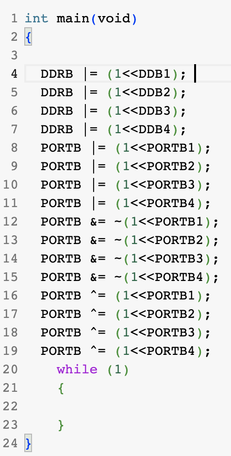
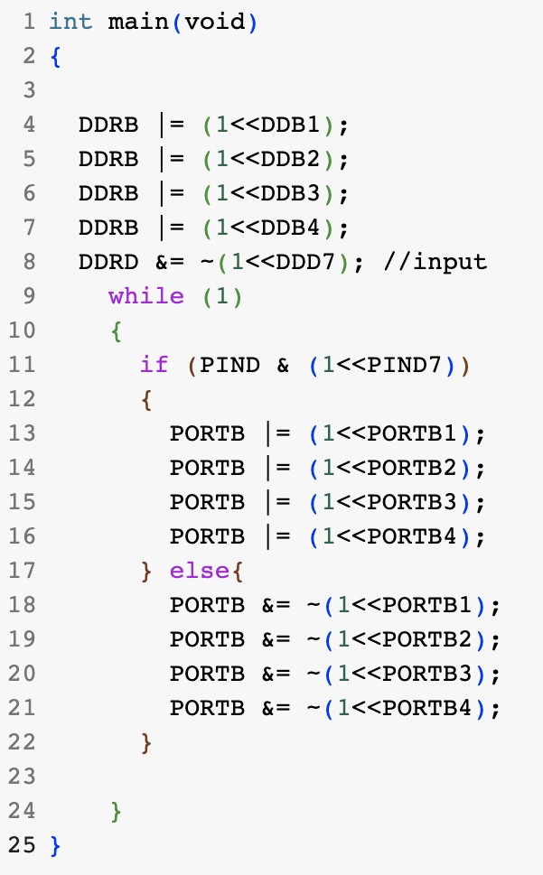
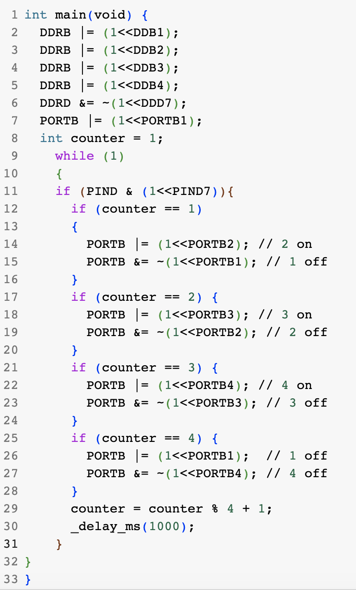
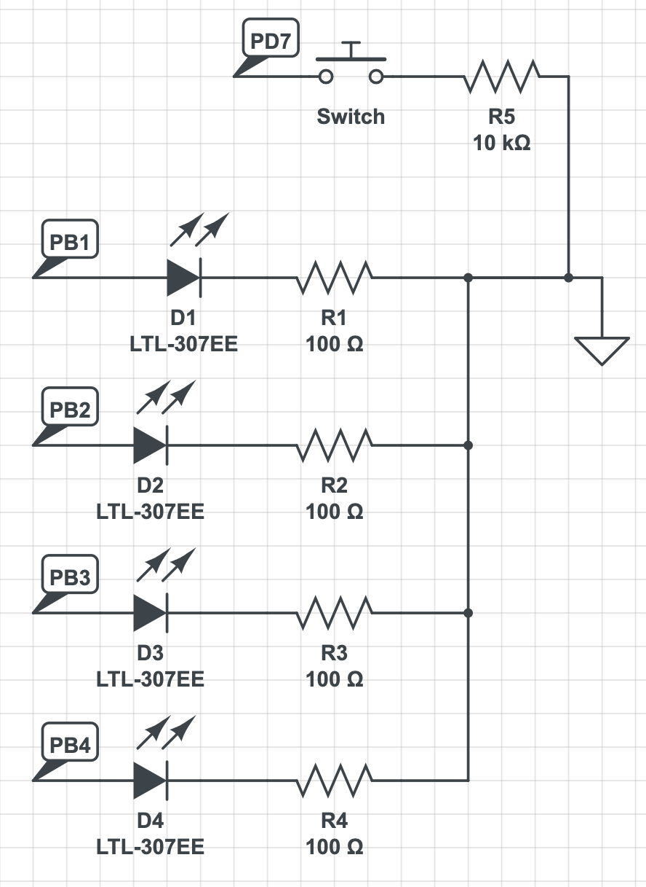
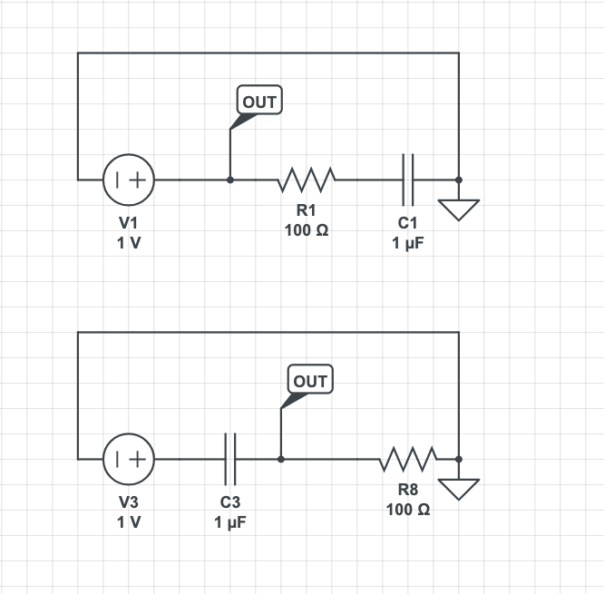
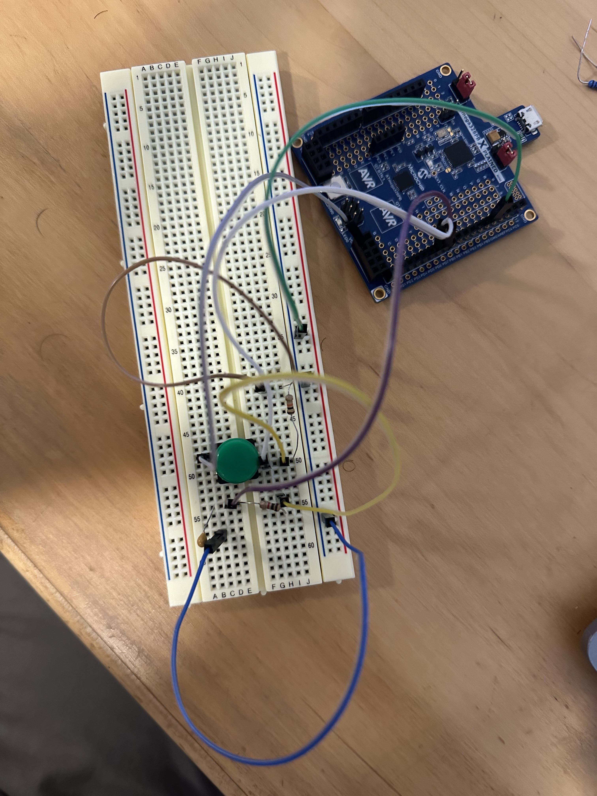

# lab2_morse_skeleton

    * Name: George Eliadis
    * Github Repository URL: https://github.com/proflocorporate/ese3500lab2 
    * Description of hardware: embedded hardware (ATmega328PB) & laptop

### 0

Someday I will rule you all

### 1

See markdown image

### 2

See markdown image

### 3

See markdown image

### 4

See markdown image

### 5

One advantage to using interrupts over polling for this task is efficiency. Since the application here is responding to a button click, responding to interrupts when they happen is far more efficient than continuously polling for clicks, which expands a lot of CPU while constantly checking for a condition to be met. 

One potential disadvantage to interrupts over polling in this application is the added complexity, especially for a behavior as simple as this one. Coding interrupts takes special care to ensure the remaining codebases’ integrity is not compromised when interrupts happen at potentially unexpected times.

### 6

Because clock frequency is 16 mHz, meaning each tick is 1/(16*10^6) seconds, the number of “ticks” can be calculated easily for each length of time. 

30ms: (30ms*(16*10^6 "ticks"/s)) = 480,000 "ticks”
200ms: (200ms*(16*10^6 "ticks"/s)) = 3,200,000 “ticks”
400ms: (400ms*(16*10^6 "ticks"/s)) = 6,400,000 “ticks”

### 7

Using a prescaler allows our microcontroller to work with a wider range of frequencies. By adjusting the prescaler value, which divides the incoming signal, we are effectively scaling down the frequency our components see, accommodating a wider range of frequencies than our clock provides, which is unable to manipulate the incoming signal in such a fashion without the aid of a prescaler. 

### 8

See markdown image

The high pass filter on the top of the picture, while the bottom circuit 
represents the low pass filter. 

### 9

See markdown image

### 10

Circuit was noisy so couldn't snap reliable photo of scope in time.

### 11

Circuit was noisy so couldn't snap reliable photo of scope in time.

### 12

Theoretically speaking, the 10nF capacitor is more desirable for hardware bouncing, since it functions as a sufficient filter without blurring out button presses. 

### 13

In progress

### 14

In progress

## Github Repo Submission Resources

* [ESE5160 Example Repo Submission](https://github.com/ese5160/example-repository-submission)
* [Markdown Guide: Basic Syntax](https://www.markdownguide.org/basic-syntax/)
* [Adobe free video to gif converter](https://www.adobe.com/express/feature/video/convert/video-to-gif)
* [Curated list of example READMEs](https://github.com/matiassingers/awesome-readme)
* [VS Code](https://code.visualstudio.com/) is heavily recommended to develop code and handle Git commits
  * Code formatting and extension recommendation files come with this repository.
  * Ctrl+Shift+V will render the README.md (maybe not the images though)
